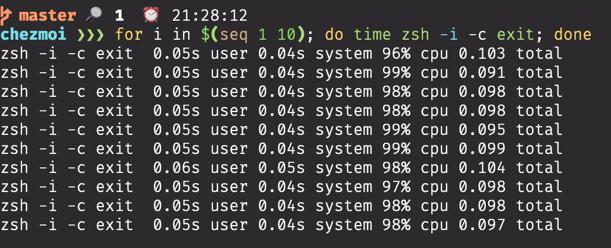

# dotfiles



This repository contains
- Fast zsh environment by [zinit](https://github.com/zdharma/zinit)
- Beautiful prompt by [starship](https://github.com/starship/starship)
- Easy and safe management by [chezmoi](https://github.com/twpayne/chezmoi)
- My app configs(neovim, tig, tmux, ...)

## How to init

```sh
# install chezmoi
curl -sfL https://git.io/chezmoi | sh && cp ./bin/chezmoi /usr/local/bin/chezmoi

# init
chezmoi init --apply https://github.com/kitagawa-hr/dotfiles.git
```
